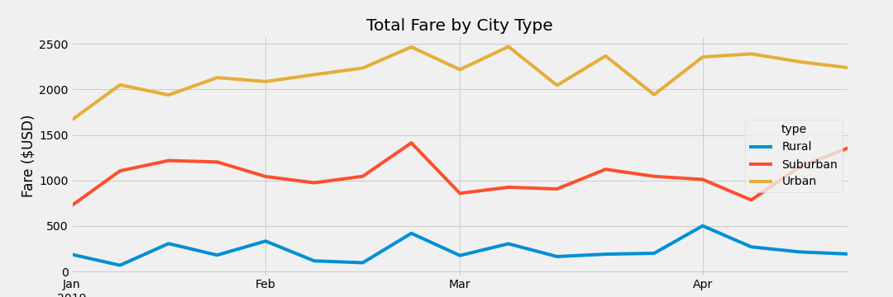

# PyBer_Analysis

## Overview

Omar and I are working on a project in Python and Pandas to look for data trends in ride sharing data by city type. We will summarize how the data for drivers, riders & fares differ by city type. This analysis may aid executives and management at PyBer to make decisions about their company directions. 

## Results

The ride sharing data between the different city types shows that there are the most riders in Urban environments(~70%), and the least in Rural city types. There are also the most drivers in Urban cities. On average, fares are much higher in rural & suburban cities than in urban cities. This is similar for the fares per driver. Below is a graph to highlight these statistics more. 

## Summary

Overall based on the results above, we can conclude that by adding more drivers into the rural communities may mean that more rural & suburban cities may show increased rides since right now it may be hard for them to find available drivers. 
